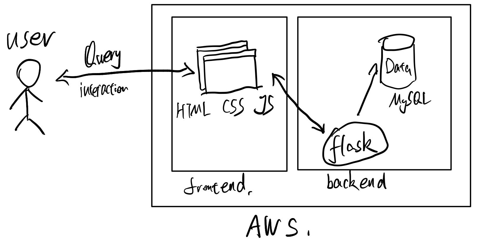
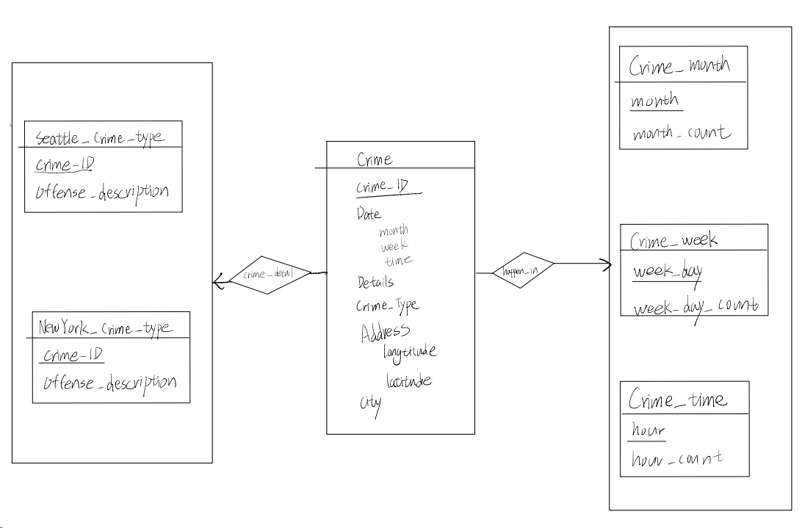

<div align="center">   
  <h1>CrimeStatisticsWebsite</h1>
</div>

## Website Link

[HomePage](http://ec2-3-129-63-152.us-east-2.compute.amazonaws.com/~fslllllki/CrimeStatisticsWebsite/index.html)


## Recently Updates
**Nov 10, 2023:**
We constructed a basic frontend web page and displayed the visualization results of the geographical coordinates. 
Moving forward, we plan to utilize the six processed data tables (corresponding to the six entities in our database) for further development.

**Nov 2, 2023:**
We have conducted an initial extraction and filtering of the data. Currently, we have obtained six data tables corresponding to the required entities.

**Oct 26, 2023:**
After further team discussions, we have finalized the division of labor and established a plan for executing the project.

**Nov 20, 2023:**
Add some frontend pages

**Dec 2, 2023:**
Add the backend code written by flask, and Modified and improved some front-end codes

**Dec 6, 2023:**
Adjusted the complete code, organized and uploaded


## Install

```bash

git clone https://github.com/ShenglanFang/CrimeStatisticsWebsite

```


## Project Introduce

### Title:
Crime Statistics Website

### List of team members:
Shenglan Fang ([shenglan.fang@yale.edu](shenglan.fang@yale.edu))

Hanqing Liu ([hanqing.liu@yale.edu](hanqing.liu@yale.edu))

Qiuhao Zhang ([qiuhao.zhang@yale.edu](qiuhao.zhang@yale.edu))


### Problem Description:
We analyze the crime data in New York city and Seattle. 
Benefits:
- determine and measure the degrees of the safety of their living environment and reduce risks
- provide insights into the cultural and geographical differences that exist across the country.


Our team aims to analyze the crime data in New York city and Seattle. Crime statistics are crucial to both local people and justice professionals. For local residents, they can determine and measure the degrees of the safety of their living environment and reduce risks. For legislators and justice professionals, they can anticipate the increased risk of crime, and this can be followed up by law enforcement intervention to prevent the predicted crimes from occurring. And also we choose crime data from two cities each one the East Coast and the other one form West Coast of the United States. In this case, comparing cities from these coasts can provide insights into the cultural and geographical differences that exist across the country. This comparison can provide valuable insights for those considering relocation, businesses looking to expand, researchers studying regional differences, and policymakers addressing urban and regional challenges.

### Real data we choose:
NYC crime data from NYC Open Data:

[NYC crime data](https://data.cityofnewyork.us/api/views/5jvd-shfj/rows.csv?accessType=DOWNLOAD)

Seattle crime data from Seattle Police Department:

[Seattle crime data](https://data.seattle.gov/Public-Safety/SPD-Crime-Data-2008-Present/tazs-3rd5/about_data)

### Basic architecture
Technology stack used: JavaScript, HTML, CSS, MySql, Flask.

Basic Architecture of our Project

Our application is structured on a robust and scalable architecture that integrates both client-side and server-side components hosted on Amazon Web Services (AWS).

**Frontend:**
User Interface (UI): The UI is developed using HTML, CSS, and JavaScript, ensuring a responsive and interactive experience for users. It is designed to facilitate user queries and display data in an accessible format.

Interaction: Users interact with the frontend through queries, which are then processed by our backend.

**Backend:**
Flask Application: Serving as the backbone of our backend, the Flask framework handles HTTP requests and performs the necessary logic to retrieve or manipulate data in the database.

Database (MySQL): Our choice of database is MySQL, which stores all application data. Flask serves as an intermediary, allowing for communication between the frontend and the database.

**Infrastructure:**
AWS EC2 Instances: Both the frontend and backend are deployed on AWS EC2 instances. This infrastructure provides reliable computing resources and allows our system to scale as needed based on user demand.

This architecture provides a clear separation of concerns, with the frontend dedicated to user interactions and the backend focused on data management and business logic. The use of AWS as our cloud provider offers a dependable and secure environment for our full-stack application.


### System Features:
**Feature 1**: Show which types of locations are most likely for a crime to happen in Seattle and New York City.
We shall group the dataset by Location description and count the occurrence of crime in each category. From the number calculated, we could make a bar chart to compare crimes that happened in different types of places. Any place with a high number of crimes on the chart could tell us if it is more dangerous than other places in general. The user could get an insight into what kind of places are more dangerous and they should avoid themselves to travel through those places alone.

**Feature 2**: Show in which time period of a day, the criminal incidents happen most frequently in Seattle and New York City.
This feature enables law enforcement to strategically allocate resources and implement safety measures during high-crime hours, ultimately enhancing public safety. Residents and businesses can make informed decisions and choose the time of their activities to ensure safety. Additionally, this data-driven approach informs policy development and helps reveal crime trends and patterns, promoting effective crime reduction strategies and better understanding of the nature of criminal activity within these urban centers. Comparing crime patterns across cities allows for the identification of commonalities and unique factors influencing criminal incidents in different regions.

**Feature 3**: Show in which month, the criminal incidents happen most frequently in Seattle and New York City.
For local residents, it provides vital information to adjust their safety measures and routines, allowing them to be more careful and prevent going outdoors during the peak months of criminal activity. Legislators can use this data to inform policy decisions and allocate resources for crime prevention programs tailored to the high-crime months. Justice professionals, including law enforcement and the judiciary, can optimize their strategies and responses during these critical periods, enhancing their ability to address and reduce crime effectively. In summary, this feature empowers residents to stay safe, assists legislators in crafting informed policies, and enables justice professionals to enhance their crime-fighting efforts during peak months of criminal incidents.

**Feature 4**: Show which kind of criminal incidents happen most frequently in Seattle and New York City.
For residents, this information enables them to better understand the specific safety concerns in their area. Legislators can use this data to develop targeted policies and allocate resources towards addressing the prevalent crime types, thus enhancing public safety and law enforcement efficiency. Justice professionals can focus their efforts and resources on combating the most common crimes, leading to more effective crime prevention and enforcement strategies. In summary, this feature empowers residents with knowledge about local crime trends, assists legislators in crafting informed policies, and enables justice professionals to optimize their responses to address the most frequently occurring criminal incidents.

**Feature 5**: Choose a type of criminal incident, show the summary of this specific criminal incident  in Seattle and New York City.
For residents, it provides first hand information about a specific type of incident, increasing awareness of local safety concerns and potentially motivating individuals to take necessary precautions. Legislators can use this feature to gain insight into the details of individual type of incidents, aiding in the formulation of targeted policies to address specific crime types. Justice professionals, including law enforcement and the judiciary, benefit from access to detailed incident summaries, which can aid in investigations, prosecutions, and ensuring that justice is served. Overall, this feature empowers residents with specific incident details, assists legislators in crafting informed policies, and enables justice professionals to effectively handle individual cases and maintain public trust.
 

### Technology Stack:
Python – Flask
HTML, CSS, JavaScript
SQL - MySQL
AWS EC2


### Justification for Technology Choices:
**Python**: First of all, all of our team members are familiar with Python and it’s easy to use. Flask is a powerful Python web framework that offers various features and libraries for building web applications efficiently. It is suitable for web development, has strong community support, and provides security features essential for a crime statistics website. And also, Flask provides greater flexibility for smaller applications.

**HTML, CSS, JavaScript**: These are fundamental web technologies for building the frontend of a website. HTML structures content, CSS styles the layout and design, and JavaScript adds interactivity. These technologies are a standard choice for web development and ensure the website is user-friendly, responsive, and visually appealing. And we are both familiar with these technologies.

**SQL (MySQL)**: MySQL is a widely used, open-source relational database management system known for its speed and scalability. It is suitable for handling structured data efficiently. And also For a crime statistics website, data integrity and availability are critical, making MySQL a suitable choice. We are both familiar with this technology because we are taking this database management course.

**AWS EC2**: AWS EC2 (Elastic Compute Cloud) is a popular cloud computing service that provides scalable and reliable infrastructure for hosting web applications. It offers flexibility in terms of server configurations, scalability, and security. AWS is a well-established cloud platform, providing the infrastructure necessary for deploying a web application with high availability and performance.


### Team Skills:
**Shenglan Fang**
Programming Languages: Python(expert), Java(expert), SQL(intermediate), JavaScript(intermediate), HTML5/CSS(intermediate)
**Hanqing Liu**
Programming Languages: Python(expert), C/C++(expert), SQL(intermediate), HTML5/CSS(intermediate)
**Qiuhao Zhang**
Programming Languages: Python(expert), C/C++(expert), SQL(intermediate), HTML5/CSS(intermediate), JavaScript(intermediate)


### System Specification:

ER-diag of our Project

### Entities:
**Seattle_Crime_Type:**
Attributes: Crime_ID, Offense_Description
Description: This entity represents the different types of crimes that are recorded in Seattle. Each crime type has a unique ID and a description of the offense.

**NewYork_Crime_Type:**
Attributes: Crime_ID, Offense_Description
Description: This entity represents the different types of crimes recorded in New York. Like the Seattle entity, each crime type has a unique ID and a description.

**Crime:**
Attributes: Crime_ID, Date, Details, Crime_Type, Address, Longitude, Latitude, City
Description: This entity captures the details of individual criminal incidents. Each crime has a unique ID, the date it occurred, details of the crime, its type, address where it happened, coordinates, and the city where it occurred.

**Crime_Month:**
Attributes: Month, Month_Count
Description: This entity represents data aggregated on a monthly basis. It shows the total count of crimes for each month.

**Crime_Week:**
Attributes: Week_Day, Week_Day_Count
Description: This entity represents data aggregated based on the day of the week. It provides the total count of crimes for each day of the week.

**Crime_Time:**
Attributes: Hour, Hour_Count
Description: This entity shows data aggregated on an hourly basis. It indicates the total count of crimes for each hour of the day.

### Relationships:
**Crime_Detail:**
Description: This relationship links the Crime entity with the crime type entities (Seattle_Crime_Type and NewYork_Crime_Type). It helps determine the type of each crime incident based on the city where it occurred.

**Happen_In:**
Description: This relationship connects the Crime entity with the time-based aggregation entities (Crime_Month, Crime_Week, and Crime_Time). It helps identify when each crime incident occurred in terms of month, day of the week, and hour.

**Unique Constraints:**
Crime_ID in Seattle_Crime_Type: No two records can have the same Crime_ID in the Seattle_Crime_Type table.
Crime_ID in NewYork_Crime_Type: No two records can have the same Crime_ID in the NewYork_Crime_Type table.
Crime_ID in Crime: Every crime should have a unique identifier.

### Check Constraints:
**Month in Crime_Month:** Values should be between ‘Jan’ and ‘Nov’.
**Week_Day in Crime_Week:** Values should fall within the names of the days in a week, e.g., 'Monday', 'Tuesday', etc.
**Hour in Crime_Time:** Values should be between 0 and 23.
**Longitude and Latitude in Crime:** These values should be within valid geographical coordinate ranges. For example, latitudes range from -90.0 to 90.0 and longitudes range from -180.0 to 180.0.
**City in Crime:** The values should only be "Seattle" or "New York", assuming the dataset is only concerned with these two cities.

### Referential Integrity Constraints:
**Crime_Type in Crime:**  This should be a foreign key referencing Crime_ID from either Seattle_Crime_Type or `NewYork_Crime_Type depending on the city of the crime. This ensures that every crime recorded is of a type known to either Seattle or New York's crime classifications. 

**Crime_ID in Crime with Crime_Month, Crime_Week, and Crime_Time:**  The Crime_ID in the Crimetable should reference the respective Crime_ID in the time-based aggregation entities (Crime_Month, Crime_Week, and Crime_Time). This ensures that aggregated data matches the specific incidents in the Crime` table.

**City in Crime:** If the city is "Seattle", then the Crime_Type should reference Seattle_Crime_Type. If the city is "New York", then the Crime_Type should reference NewYork_Crime_Type.


### Additional Constraints:
**NotNull:** Certain fields like Crime_ID, Date, and City in the Crime table should not be null as they are critical to the record's identity and categorization.

**Default Values:** For certain fields, you might want to set default values. For example, the Details attribute in the Crime table could have a default value of "Not provided" if no specific details about the crime are given.

### Technical challenges
In the course of our project, we navigated various technical challenges, leading to critical decision-making in two main areas:


**Adoption of Amazon Web Services (AWS) EC2 (Elastic Compute Cloud):**

Positive Aspects:


Scalability: EC2's scalability was pivotal in managing the fluctuating traffic demands of our full-stack application. Its ability to dynamically adjust computing resources ensured operational efficiency during varying load conditions.

Developmental Versatility: EC2's compatibility with diverse development frameworks and programming languages enhanced our ability to build and deploy a range of full-stack application features.

Enhanced Security: Implementing AWS's comprehensive security measures, including network firewalls and data encryption, significantly bolstered our application's defense against unauthorized access and potential data breaches.

**Utilization of Flask for Database Interaction:**

Negative Aspects:


Runtime Dependency: Our reliance on Flask for database interaction introduced a constant runtime requirement. This dependency limited our flexibility in database operations, particularly when these needed to be executed independently of the Flask application or outside web requests.

Performance Constraints: Utilizing Flask solely for database interactions led to unnecessary performance bottlenecks. Exploring more direct or streamlined methods for database connectivity might have offered greater efficiency, especially for straightforward or repetitive database tasks.

Single Point of Failure: Centralizing database operations through the Flask application exposed our system to heightened risk. Any complications within the Flask framework, such as server downtime or bugs, had direct and potentially severe implications on the entirety of our database operations, affecting both the availability and reliability of the application. 

These decisions, both positive and negative, have been instrumental in shaping our understanding of effective and efficient application development, providing valuable lessons for future projects.

